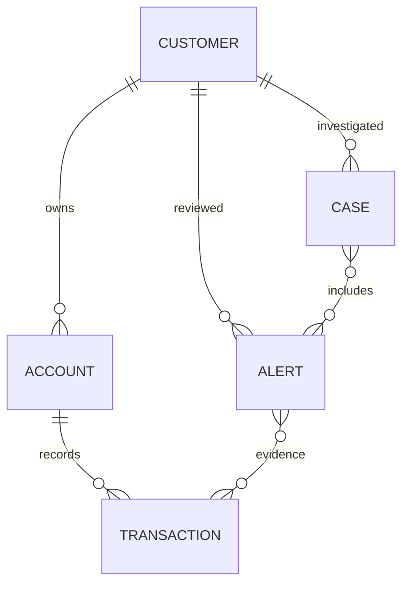

# Sentinel AML

Java 21 / Spring Boot / PostgreSQL transaction monitoring with a minimal React analyst workspace.
Parts A and B and the nine business rules are implemented. CSV and JSON batch imports run as durable asynchronous jobs. Redis, Kafka and the challenge's
remaining Extension Ideas are outside the agreed scope.

See the [system architecture and engineering guide](docs/architecture.md) for the complete
component map, ingestion and detection flows, data model, rules, security, APIs, operations,
and current implementation limits. See [async ingestion](docs/async-ingestion.md) for the 202 response
contract, polling, restart behavior and single-instance deployment requirement.

## Run locally

Requires Java 21, Docker Compose or PostgreSQL 14+, and Node.js 20.19+ (20.x) or 22.12+ with npm for the frontend.

1. Run `cp .env.example .env` and supply your own database and API-user passwords.
   `POSTGRES_PASSWORD` and `SPRING_DATASOURCE_PASSWORD` must match. Set the database port/URL
   to an unused port if another PostgreSQL instance is already running.
2. Load the environment and start the backend:

```sh
set -a
source .env
set +a
docker compose up -d --wait
./gradlew bootRun
```

Flyway applies the schema migrations on startup. The API defaults to `http://localhost:8080`.
The API has no fallback passwords: roles with an empty password are unavailable.

3. In another terminal start the frontend:

```sh
cd frontend
npm ci
npm run dev
```

Open the local URL printed by Vite (normally `http://localhost:5173`).
Sign in as `admin`, `analyst` or `viewer` with the password configured for that role.
Vite proxies `/api` to port 8080; set `VITE_API_PROXY_TARGET` for another backend origin.
Production static hosting requires an `/api` reverse proxy and HTTPS for Basic authentication.
Credentials stay in frontend memory, and signing out or refreshing discards them.

| Role | Access |
| --- | --- |
| ADMIN | Ingest/import data, administer rules/FX/risk lists, investigate and dispose alerts/cases |
| ANALYST | Read authorized customer/transaction details, investigate and dispose alerts/cases |
| VIEWER | Read masked queues and lists; no sensitive customer/transaction details or mutations |

## Processing architecture

```text
CSV / JSON batch -> durable PostgreSQL job -> 202 + polling -> background worker
Individual transaction / idempotent stream -> process during the HTTP request
Both paths, for each transaction:
  -> validate input and relationships
  -> start database transaction and lock the customer row
  -> normalize money using effective FX rates
  -> persist the payment
  -> load bounded detection context
  -> execute independently registered rule strategies
  -> combine weighted findings and merge customer/day alert evidence
  -> append audit events
  -> commit payment + alerts + audit atomically
```

Detection runs atomically with each transaction: a successfully processed transaction has already been evaluated.
Single-transaction requests wait for this result; CSV and JSON batch requests return `202 Accepted`
after queuing durable input. Poll the returned job URL for processing results.
There is no message broker or cache dependency. Failed detection rolls back the payment and its
findings. CSV/batch records commit independently, so a rejected row does not discard good rows.
CSV parsing is incremental, with at most 200 errors in a terminal job result; every rejected
record is persisted to the ingestion error log. File limits default to 50 MB.

The database customer lock serializes streams across all accounts for the same customer,
including customer-wide behavioral rules. Transaction references have durable uniqueness;
identical stream replays return the existing transaction, and conflicting replay payloads are
rejected. Strict create/CSV duplicates are rejected. Customer/account updates use business keys;
an existing account cannot be reassigned to another customer.

Late-arriving records also re-evaluate affected later events. Lookbacks follow configured rule
windows, use UTC timestamps/days, and exclude future transactions from each evaluated event.
Large historical backfills can cost more than chronological ingestion; submit them as CSV or batch jobs.

## Detection and business rules

| Rule | Default behavior |
| --- | --- |
| CTR | Every transaction at or above USD 10,000 equivalent is flagged |
| STRUCTURING | At least 3 same-account transactions of USD 9,000–9,999 inclusive within 24 hours |
| RAPID_MOVEMENT | At least 80% of a deposited value flows out within 48 hours; earlier outflows do not count |
| HIGH_RISK_JURISDICTION | Either country field or an exact configured counterparty account/name match flags any amount |
| BEHAVIORAL_DEVIATION | Today's customer-wide count **or** value exceeds 3× the preceding 90 full UTC days' average |
| ROUND_NUMBER | At least 3 amounts that are multiples of USD 1,000 within 24 hours |

Structuring covers repeated just-below-threshold transactions. Rapid-movement direction accepts
IN/OUT, CREDIT/DEBIT, INBOUND/OUTBOUND and equivalent documented direction values; explicit deposit/
withdrawal types can supply direction when omitted. Supplying direction is recommended for every payment.
Behavioral baselines include inactive days and require at least one prior transaction. A new
customer without history is evaluated by the other rules, rather than assigned an invented baseline.
The default 90-day denominator can be sensitive to sparse history; tune the multiplier/window as needed.

Rules implement `DetectionRule` and return score, evidence references and explanation without
performing persistence. Spring discovers rule implementations. `DetectionEngine` orchestrates
context, scoring and persistence. Configuration is stored in `rule_config` and applied on the next
transaction without a restart. Mandatory CTR and high-risk rules cannot be disabled through the API.

Scores combine distinct triggered-rule weights, capped at 100. Severity is LOW below 30, MEDIUM
30–59, HIGH 60–79 and CRITICAL 80–100. The queue orders by risk before pagination. Open findings for
one customer and UTC day are merged, retaining the union of evidence and rules. This intentionally
aggregates several typologies into one investigation alert; it does not emit an alert for every
payment. Disposed alerts remain untouched. New evidence can create a new alert, while replay of
an already-reviewed finding does not reopen it.

Every stored amount has a base-currency amount (INR by default). Rates are effective-dated and
missing/nonpositive FX is rejected; no foreign amount is silently compared as INR. Thresholds
specify their own currency, default USD. Seeded exchange rates and risk-country lists are synthetic
demo configuration, not current financial data or an authoritative sanctions feed.

## Analyst workflow and privacy

The frontend provides sign-in, ranked alert queue, page-scoped risk distribution, explanations and
transaction evidence, customer/account timelines, case creation and disposition, CSV imports,
single-transaction submission and administrator configuration editors.

Alert clear/close and case close/SAR_FILED require a nonblank disposition reason on the server.
Ordinary workflow cannot reopen or delete terminal records. Case alerts must belong
to the same customer. Actor identity comes from authentication, never a caller's `actor` field.
Every alert/case creation, detection evidence update and state transition appends timestamped
audit history. PostgreSQL triggers reject audit UPDATE, DELETE and TRUNCATE. Alert/case optimistic
versions detect concurrent changes and return HTTP 409.

List responses mask names, contact information and customer identifiers; full details require
ADMIN/ANALYST authorization. Numeric customer record IDs provide authorized detail lookup without
putting external customer identifiers in list views. Free-form case/alert narratives are omitted
from lists and viewer responses. The frontend's masking is backed by API authorization and DTOs.

`SAR_FILED` records an analyst workflow status; it does not send any report externally.

For rule-configuration demos, an administrator can save rule changes and use **Configuration →
Detection rules → Regenerate alerts**. Confirming replaces every alert (including reviewed alerts)
with fresh findings from all stored transactions at their original event times under the saved rules.
New findings start open with new references; previous assignments and dispositions are not carried
forward. Customers, accounts, transactions, cases and audit history remain. Existing case-alert links
are removed and audited; new alerts can be added to investigations through the normal workflow.
The replacement and its audit entries commit atomically; any failure preserves the previous alerts
and case links. PostgreSQL writers wait during the rebuild, while readers see the previous committed
alerts. This synchronous operation is intended for the demo dataset; larger histories take longer.

## API and configuration

All application routes are under `/api/v1`. See the [OpenAPI specification](docs/openapi.yaml)
for request schemas, responses and authentication.

| Routes | Purpose |
| --- | --- |
| `/session` | Current authenticated username and roles |
| `/customers`, `/accounts`, `/transactions` | Create/read records, paginated lists and detail |
| `/customers/by-id/{id}` | Authorized customer detail by numeric record ID |
| `/transactions/stream` | Idempotent individual ingest (201 new, 200 replay, 409 conflict) |
| `/ingestion/{customers,accounts,transactions}/csv` | Multipart `file`; returns 202 + queued job |
| `/ingestion/{customers,accounts,transactions}/batch`, `/transactions/batch` | JSON arrays; returns 202 + queued job |
| `/ingestion/jobs`, `/ingestion/jobs/{id}` | ADMIN recent jobs and persisted progress/results |
| `/ingestion/errors` | Paginated rejected records, optional batch ID |
| `/alerts`, `/cases` | Risk queue and investigation workflow |
| `/alerts/{ref}/status`, `/cases/{ref}/status` | PATCH state/assignment/disposition |
| `/audit?entityRef=...` | Authenticated analyst audit history |
| `/admin/alerts/regenerate` | ADMIN GET preview counts; POST confirmed atomic rebuild from stored transactions |
| `/rules`, `/rules/{code}` | ADMIN read/update enabled flag and validated JSON configuration |
| `/settings/exchange-rates` | ADMIN effective-dated FX list/upsert |
| `/settings/high-risk-jurisdictions` | ADMIN effective-dated country list/upsert |
| `/settings/sanctioned-counterparties` | ADMIN exact identifier/name list/upsert |

Amounts accept up to 17 integer digits and 2 decimal places. Transaction timestamps are stored at
microsecond precision. Pagination supports `page`, `size`, and `sort` (maximum page size 500).
Validation/auth/conflict errors use consistent ProblemDetail JSON with appropriate HTTP status.

## Data model and migrations



Additional tables: `exchange_rates`, `rule_config`, `high_risk_jurisdictions`,
`sanctioned_counterparties`, `ingestion_errors`, `ingestion_jobs`, `ingestion_job_payloads`, `audit_log`. Account risk rating is stored separately
from customer risk rating. SQL migrations are in `src/main/resources/db/bootstrap/`:
V2 core schema, V3 FX seed, V4 retired sample table, V5 configuration scaffolding,
V6 operational detection/threshold corrections, V7 audit enforcement and optimistic versions,
and V8 durable ingestion jobs and payload storage.

## Demo data and panel walkthrough

Use the CSV files in [docs/demo-data](docs/demo-data/README.md): **13 fictional customers,
13 accounts, and 129 transactions**. The dataset uses 15 January 2030 and a preceding
90-day behavioural baseline; seeded FX and screening entries are synthetic.

1. Sign in as `admin` and open **Import data**.
2. Import `customers.csv`; wait for the job to complete and check failures.
3. Import `accounts.csv`, wait for completion, then import `transactions.csv` and wait again.
4. With default rules/reference data, inspect three HIGH and three CRITICAL scenarios.
   `CRITICAL_LAYERING` combines five rules into a score of **100 / CRITICAL**.
5. Open the evidence, create an investigation case, and record a disposition reason.

Existing transaction references are rejected on CSV reimport. A `COMPLETED` job can still
contain rejected rows; inspect its failure count. See the [panel presentation](presentation.md)
for rule examples, speaker notes, and the demo script.

## Deployment and troubleshooting

- Run **one backend instance** against the import queue. Queued jobs survive restarts;
  interrupted running jobs become FAILED and need review before resubmission.
- If sign-in fails, verify the corresponding `SENTINEL_*_PASSWORD` is configured in the
  backend process. A blank password disables that role.
- If startup cannot connect to PostgreSQL, check database health and matching database
  name, username, password, port, and JDBC URL in `.env`.
- If a record fails with missing FX or an unknown account, configure an effective exchange
  rate or complete the prerequisite customer/account import before resubmitting.
- If a job stays QUEUED, check worker configuration and backend logs. Polling and recovery
  details are in [async ingestion](docs/async-ingestion.md).

## Documentation map

| Document | Purpose |
| --- | --- |
| [Architecture](docs/architecture.md) | Components, data model, detection semantics and limits |
| [Async ingestion](docs/async-ingestion.md) | Job API, progress, recovery and operating limits |
| [OpenAPI](docs/openapi.yaml) | Request/response schemas and authentication contract |
| [Demo data](docs/demo-data/README.md) | CSV scenarios, expected outcomes and assumptions |
| [Verification](docs/verification.md) | Current checks and clearly labelled historical measurements |
| [Presentation](presentation.md) | Panel talk, six rules, demo and questions |
| [Frontend](frontend/README.md) | UI setup, roles and available workflows |

## Demonstration and verification

```sh
./gradlew test
python3 scripts/demo.py
python3 scripts/benchmark.py
cd frontend
npm run build
npm run lint
```

The demo reads the configured admin/analyst passwords from the environment and uses a unique
synthetic run prefix. It creates all six rule scenarios, checks evidence/scores and replay,
opens/disposes a case, clears an alert with a reason, and verifies authenticated audit identity.
It creates persistent synthetic records in the selected development database; it never deletes
existing data. Set `SENTINEL_BASE_URL` to use another backend origin.

CSV examples covering the typologies are in [docs/demo-data](docs/demo-data/README.md).
The benchmark creates 10,000 simulated payments across 100 customers with all rules enabled,
checks high-risk alerts, measures bulk time and samples individual streaming latency.

See [verification results](docs/verification.md) for measured results and limits.
The earlier [requirements audit](docs/requirements-audit.md) and
[architecture audit](docs/architecture-audit.md) are historical baseline reviews;
Redis/Kafka remain excluded; asynchronous imports are now implemented as described in [async ingestion](docs/async-ingestion.md).
