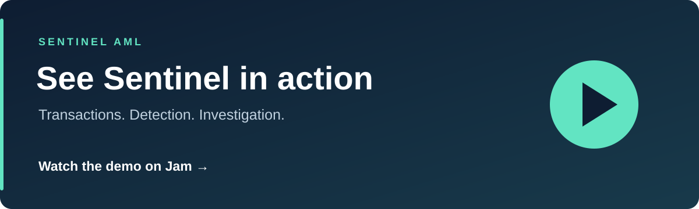

# Sentinel AML

A transaction-monitoring app that flags suspicious activity and helps analysts investigate it.

## Watch the demo

**[▶ Play the full demo on Jam](https://jam.dev/c/c1d03ce5-9d78-4930-a9d7-a43dae5a7ad6)**

## What it does

- Import transactions from CSV files or APIs, with progress tracking.
- Detect six patterns, including structuring, rapid fund movement and unusual behaviour.
- Show risk scores, explanations and the transactions behind each alert.
- Manage investigations and record analyst decisions with an audit trail.

Built with **Java 21, Spring Boot, PostgreSQL, React and TypeScript**.

## Run locally

You'll need Java 21, Docker Compose and a compatible Node.js version.

1. Follow the **[setup guide](docs/getting-started.md)** to start the backend and frontend.
2. Sign in with the administrator credentials you configured.
3. Load the **[sample data](docs/demo-data/README.md)** to explore the alerts.

The demo dataset contains **13 fictional customers, 13 accounts and 129 transactions**.

## Learn more

| Guide | What's inside |
| --- | --- |
| [Detection rules](docs/detection-rules.md) | How the six rules and risk scores work |
| [Analyst guide](docs/analyst-guide.md) | Review alerts and manage investigations |
| [Architecture](docs/architecture.md) | How the system is built |
| [API guide](docs/api-guide.md) | Endpoints and request schemas |
| [Panel presentation](presentation.md) | Walkthrough and speaker notes |
| [All documentation](docs/README.md) | Setup, tests, background jobs and more |
