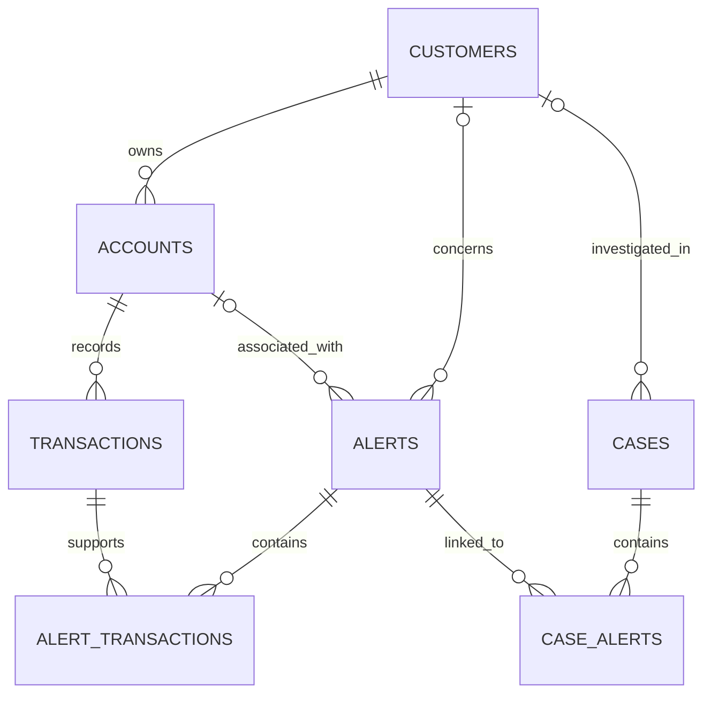

# Sentinel AML — System Architecture and Engineering Guide

**Architecture snapshot:** 19 September 2026\
**Scope:** The implementation in this repository, including the Java backend, React frontend, PostgreSQL schema, configuration, and verification assets.

This document explains how Sentinel accepts financial activity, evaluates suspicious patterns, and supports analyst investigations. Implementation statements are based on the current source. Previously recorded test and benchmark results are identified separately; they are not new measurements taken while writing this document.

## Contents

1. [Purpose and system boundaries](#1-purpose-and-system-boundaries)
2. [Runtime architecture](#2-runtime-architecture)
3. [Code organization](#3-code-organization)
4. [Domain and database model](#4-domain-and-database-model)
5. [Ingestion and validation](#5-ingestion-and-validation)
6. [Detection engine](#6-detection-engine)
7. [Currency and time semantics](#7-currency-and-time-semantics)
8. [Scoring, evidence, and alert aggregation](#8-scoring-evidence-and-alert-aggregation)
9. [Investigation workflow](#9-investigation-workflow)
10. [Authentication, privacy, and audit](#10-authentication-privacy-and-audit)
11. [API map and error handling](#11-api-map-and-error-handling)
12. [Frontend architecture](#12-frontend-architecture)
13. [Configuration and database evolution](#13-configuration-and-database-evolution)
14. [Running and operating the system](#14-running-and-operating-the-system)
15. [Verification and performance evidence](#15-verification-and-performance-evidence)
16. [Design tradeoffs and current limitations](#16-design-tradeoffs-and-current-limitations)
17. [Extending the implementation](#17-extending-the-implementation)
18. [Source reading map and terminology](#18-source-reading-map-and-terminology)

## 1. Purpose and system boundaries

Sentinel is a rule-based anti-money-laundering transaction-monitoring application. Administrators load customer and account records, submit transactions, and maintain detection settings. The backend evaluates incoming activity and produces explainable alerts. Analysts inspect the supporting transactions, open investigation cases, and record decisions with audit history. Viewers can access masked lists and queues.

The main business flow is:

```text
Customer records → account records → financial transactions
    → rule evaluation → scored alerts with evidence
    → analyst review → investigation case → recorded disposition
```

Six rule implementations cover threshold, structuring, rapid movement, jurisdiction/counterparty, behavioral, and round-number patterns. The separate requirement audit maps these implementations to the challenge's business requirements; the number of business requirements is not the number of Java rule classes.

The current runtime is a **modular monolith with asynchronous bulk ingestion and synchronous detection per record**. PostgreSQL is the durable source of truth. A successful new-transaction response means the transaction and its detection output have committed. Here, “streaming” means clients repeatedly submit individual transactions over HTTP.

There is no Kafka broker, Redis cache, machine-learning service, external sanctions feed, or external SAR submission integration in this implementation. `SAR_FILED` is a case status recorded by an analyst.

## 2. Runtime architecture

```mermaid
flowchart LR
    Admin[Administrator]
    Analyst[Analyst or viewer]
    Client[Transaction producer or scripts]

    subgraph UI[React analyst workspace]
        Screens[Queues, evidence, cases, imports, settings]
        APIClient[Authenticated fetch client]
        Screens --> APIClient
    end

    subgraph Backend[Spring Boot application]
        Security[Security filter and role checks]
        Controllers[REST controllers]
        Ingestion[Ingestion and validation services]
        Detection[Detection engine and six rules]
        Workflow[Query and investigation services]
        Audit[Audit service]
        Repositories[JPA repositories]
        Security --> Controllers
        Controllers -->|Single record| Ingestion
        Controllers -->|CSV / batch| Jobs[Durable import jobs]
        Jobs --> Repositories
        Jobs --> Worker[Single background worker]
        Worker --> Ingestion
        Controllers --> Workflow
        Ingestion --> Detection
        Detection --> Audit
        Workflow --> Audit
        Ingestion --> Repositories
        Detection --> Repositories
        Workflow --> Repositories
        Audit --> Repositories
    end

    Admin --> Screens
    Analyst --> Screens
    APIClient -->|HTTP /api/v1| Security
    Client -->|JSON or multipart CSV| Security
    Repositories --> DB[(PostgreSQL)]
```



### Runtime components

| Component | Technology declared in repository | Responsibility |
| --- | --- | --- |
| Backend | Java 21, Spring Boot 4.1.1 | HTTP API, validation, detection, investigation, authorization |
| Persistence | Spring Data JPA / Hibernate, PostgreSQL driver | Entity mapping, transactions, locking, database queries |
| Database | PostgreSQL 16 Alpine in Docker Compose | Durable business data, reference data, evidence, error and audit records |
| Schema management | Flyway | Apply V2–V8 migrations before Hibernate schema validation |
| Frontend | React 19, TypeScript 6, Vite 8, Tailwind CSS 4 | Analyst and administrator workspace |
| Mapping/parsing | MapStruct 1.6.3, Commons CSV 1.12.0 | Response mapping and incremental CSV parsing |
| Build | Gradle wrapper 9.7.1; npm | Backend and frontend build tooling |
| Tests | Spring Boot Test, Spring Security Test, H2 | Rule, service, API, and security verification |

Frontend version numbers above describe the declared dependency families. Use [frontend/package-lock.json](../frontend/package-lock.json) for resolved frontend dependencies.

During development, Vite proxies `/api` to `http://localhost:8080`. The backend connects to PostgreSQL on port 5432 by default. Compose starts the database only; the backend and frontend run separately. A deployed frontend needs static hosting and an `/api` reverse proxy to the backend. No production deployment stack is packaged here.

## 3. Code organization

The backend root package is `com.moneshwar.hackathon`.

| Path | Role |
| --- | --- |
| `src/main/java/com/moneshwar/hackathon/controller/` | Request routing and API input/output |
| `security/` under the backend package | Basic authentication, authorization, current actor, session and audit endpoints |
| `service/` | Query services and alert/case workflows |
| `service/ingestion/` | CSV/JSON ingestion, master-data upserts, validation, normalization, rejected records |
| `service/config/` | Rule defaults, stored overrides, configuration validation |
| `detection/` | Engine, strategy contract, context, result model, historical FX timeline |
| `detection/rules/` | Six independent rule strategies and shared rule helpers |
| `entity/`, `repository/` | Persistent domain model and database access |
| `dto/`, `mapper/` | API contracts and full/masked response projections |
| `exception/` | Domain exceptions and HTTP ProblemDetail translation |
| `stream/` | Retained event abstraction; not the active detection transport |
| `src/main/resources/db/bootstrap/` | Flyway schema migrations and seed data |
| `frontend/src/` | React workspace, HTTP client, administration and transaction-entry components |
| `src/test/` | Automated backend checks and H2 test configuration |
| `scripts/` | Authenticated demo and benchmark clients |
| `docs/` | API specification, fixtures, architecture, audits, recorded verification |

Controllers delegate business logic to services. Services establish transaction boundaries and call repositories. MapStruct generates response mappings during compilation. Detection strategies receive assembled context and return findings without performing database writes.

`ConfigurationController` directly uses repositories for FX, jurisdiction, and counterparty administration; rule administration goes through `RuleSettingsService`.

## 4. Domain and database model



The diagram reflects nullable customer/account links in the schema. Engine-created alerts identify a customer and account; a case may be created without a customer or linked alerts.

| Table | Identity and important data | Architectural purpose |
| --- | --- | --- |
| `customers` | Numeric `id`; unique external `customer_id`; identity/contact, KYC, PEP and risk attributes | Customer master and locking boundary for ingestion/detection |
| `accounts` | Numeric `id`; unique `account_id`; customer FK, currency, status, balances, risk rating | Account master belonging to one customer |
| `transactions` | Numeric `id`; unique `transaction_ref`; account FK, original/base amounts, time, direction, counterparty and source | Durable activity and rule evidence |
| `alerts` | Unique `alert_ref`; customer/account, rule codes, score, severity, status, explanation, dedup key, disposition, version | Aggregated finding for investigation |
| `alert_transactions` | Composite key `(alert_id, transaction_id)` | Many-to-many alert evidence without duplicate links |
| `cases` | Unique `case_ref`; optional customer, title, priority, assignment, status, disposition, timestamps, version | Analyst-managed investigation |
| `case_alerts` | Composite key `(case_id, alert_id)` | Many-to-many case/alert links |
| `rule_config` | Unique `rule_code`; enabled flag; JSON stored as text | Runtime rule settings |
| `exchange_rates` | Unique `(from_currency, to_currency, effective_from)` | Historical currency normalization |
| `high_risk_jurisdictions` | Unique `(country_code, effective_from)`; optional effective end | Event-time country screening configuration |
| `sanctioned_counterparties` | Identifier primary key; description and enabled flag | Exact counterparty account/name matching |
| `ingestion_errors` | Batch, entity type, source reference, raw record, error type/message and time | Persistent rejected-record diagnostics |
| `ingestion_jobs` | Job ID, submitter, status, counts and timestamps | Durable background import progress and recovery |
| `ingestion_job_payloads` | Job ID and Base64 input | Queued input, removed on terminal job status |
| `audit_log` | Entity type/reference, action, old/new state, actor, details, time | Append-only alert/case history |

External identifiers support imports and API lookups; numeric IDs support relational links. `accounts.customer_id` references `customers.id`, rather than the external string also named `customer_id` in the customer table. The same distinction applies to `transactions.account_id`.

Money uses Java `BigDecimal` and database `NUMERIC`, normally `NUMERIC(19,2)` for amounts and `NUMERIC(19,8)` for FX rates. Event timestamps use Java `Instant` and PostgreSQL `TIMESTAMPTZ`. Customer and account risk ratings are stored attributes; detection computes a separate alert risk score and does not automatically rewrite these master-data ratings.

Important indexes cover transaction `(account_id, transaction_time)`, transaction time, customer ownership, alert status/customer/dedup key, case status/customer, error batch ID, audit entity references, and FX currency pairs. V6 adds a unique index on the full alert dedup key. The customer/day grouping itself is enforced by the ingestion locking and merge logic, not by a unique customer/day database constraint.

## 5. Ingestion and validation

### Entry points and import order

Load **customers, then accounts, then transactions**. An account requires an existing customer; a transaction requires an existing account.

| Input | Behavior |
| --- | --- |
| Customer/account individual POST, CSV, or JSON batch | Upsert by external business key; an existing account cannot change owners |
| Transaction individual POST | Strict create; an existing transaction reference is rejected |
| Transaction CSV or JSON batch | Strict transaction creates, with per-record success/failure |
| Transaction `/stream` POST | Idempotent create-or-replay with payload comparison |

Master-data upserts apply the submitted request fields; they are not partial PATCH operations. Transaction ingestion records its source as `API`, `STREAM`, `BATCH`, or `BULK_CSV`.

### Atomic new-transaction path

```mermaid
sequenceDiagram
    participant Client
    participant Controller
    participant Ingest as TransactionIngestionService
    participant DB as PostgreSQL
    participant Engine as DetectionEngine
    participant Rules as Rule strategies

    Client->>Controller: POST transaction
    Controller->>Ingest: ingest / ingestStreamingWithOutcome
    Ingest->>Ingest: Validate request
    Ingest->>DB: Begin transaction; resolve account
    Ingest->>DB: Lock owning customer for write
    Ingest->>DB: Check transaction reference
    alt Identical stream replay
        Ingest->>Ingest: Compare payload
        Ingest->>DB: Finish transaction
        Ingest-->>Controller: Existing transaction
        Controller-->>Client: 200 OK
    else New reference
        Ingest->>DB: Read effective FX; save and flush transaction
        Ingest->>Engine: evaluate(saved transaction)
        Engine->>DB: Read settings, history and screening lists
        Engine->>Rules: Evaluate each active rule for affected anchors
        Rules-->>Engine: Findings, scores, evidence, explanations
        Engine->>DB: Create or merge alerts; append audit
        Ingest->>DB: Commit transaction and findings
        Ingest-->>Controller: Created transaction
        Controller-->>Client: 201 Created
    end
```

`TransactionTemplate` owns this boundary. `DetectionEngine.evaluate` uses `Propagation.MANDATORY`, so it requires an existing transaction. If normalization, detection, evidence persistence, or commit fails, the new payment and its associated database writes roll back together. The response contains the transaction; clients retrieve resulting alerts separately.

The pessimistic customer-row lock serializes transaction ingestion across **all accounts of the same customer**. This supports customer-wide behavioral analysis and avoids competing ingestion requests losing alert evidence. Different customers can be processed concurrently, subject to database and application capacity.

### Idempotency

For `/transactions/stream`:

- A new reference returns `201` after evaluation and commit.
- An identical existing transaction returns `200` without running detection again.
- An existing reference with different data returns `409`.
- The unique transaction-reference constraint is the final duplicate-storage guard. A unique-key race is handled by loading the existing transaction after rollback and checking the payload.

Replay checks account, amount, currency, timestamp, type, direction, counterparty fields, jurisdiction, channel, and description. Amount comparison is numeric, currency comparison ignores case, and timestamps are truncated to microseconds. Most other fields require exact equality, so semantically similar direction strings or changed whitespace can still produce a conflict.

### CSV and batch behavior

`CsvReader.forEach` incrementally parses UTF-8 input using Commons CSV, accepts a UTF-8 BOM, trims surrounding whitespace, skips empty lines, validates required headers, and reports inconsistent column counts. Duplicate or missing header names and invalid UTF-8 are rejected. A convenience `CsvReader.read` method collects rows, but the import services use the incremental path.

| Entity | Required CSV headers |
| --- | --- |
| Customer | `customer_id`, `first_name`, `last_name` |
| Account | `account_id`, `customer_id`, `currency` |
| Transaction | `transaction_ref`, `account_id`, `amount`, `currency`, `transaction_time` |

Optional columns are defined by the CSV mappers and illustrated in [demo data](demo-data/README.md). JSON uses camelCase field names; CSV uses snake_case headers. Transaction amounts must be positive with at most two fractional digits; currency must be three letters. JSON timestamps bind to `Instant`; CSV also accepts the local timestamp formats in `CsvValueParser`, interpreting timestamps without an offset as UTC.

Each row commits independently. A rejected record does not undo earlier accepted rows. Recoverable row errors allow parsing to continue; an unrecoverable parser failure ends the file, retains earlier commits, and counts the malformed trailing input/header as one rejection.

The completed job's `result` contains `batchId`, entity/source information, `totalRecords`, `succeeded`, `failed`, and up to 200 error details. CSV services bound the retained response-error list during processing. JSON batches are materialized as request lists, and the transaction batch path collects its error list before trimming the response; JSON batch memory therefore grows with input size.

Handled CSV/batch rejections are persisted in `ingestion_errors`; raw records are truncated to 4,000 characters and messages to 1,000. Administrators can retrieve all recorded errors by batch ID. This persistence depends on the database remaining available. Individual request rejections are returned as HTTP errors and do not pass through the batch error recorder.

Uploads default to 50 MB. CSV and JSON batch requests persist their input and return `202 Accepted` with a job ID and `Location` header. A single scheduled worker processes queued jobs in order; the job ID is also the error-log batch ID. ADMIN job APIs expose status, counts and final results. See [async ingestion](async-ingestion.md) for the complete contract and restart limits.

## 6. Detection engine

### Strategy contract and orchestration

Spring injects `List<DetectionRule>` into `DetectionEngine`. Each rule provides a code, title, evaluation method, and optional mandatory/same-timestamp-replay behavior. `DetectionResult` supplies whether the rule triggered, its score, transaction references, and explanation.

For each accepted transaction, the engine:

1. Takes a settings snapshot by merging built-in defaults with stored configuration.
2. Selects registered enabled rules, retaining mandatory rules even if their stored enabled flag is false.
3. Derives required historical windows from active `rolling_days` and `window_hours` settings.
4. Finds affected evaluation anchors, including later persisted events that a late arrival might change.
5. Loads the relevant customer history once for this evaluation and creates bounded contexts in memory.
6. Loads enabled counterparties, effective jurisdictions, and an FX timeline.
7. Evaluates every active rule for each anchor, then persists nonempty findings.

`TransactionContext` contains the anchor transaction, owning account/customer, account and customer history, screening lists, base currency, and historical FX lookup. Rules do not call repositories or create cases/alerts. The history is bounded by time, but the number of rows inside a time window is not capped.

### Implemented rules and defaults

| Rule code | Scope and default trigger | Default score | Main configurable fields |
| --- | --- | --- | --- |
| `CTR` | Single transaction at or above USD 10,000 equivalent; applies regardless of transaction type | 20 | `threshold_amount`, `currency`, `score` |
| `STRUCTURING` | At least 3 same-account transactions, each USD 9,000–9,999 equivalent inclusive, within 24 hours; anchor must qualify | 30 | `threshold_lower`, `threshold_upper`, `currency`, `window_hours`, `min_transactions`, `score` |
| `RAPID_MOVEMENT` | On an outgoing anchor, subsequent outflows total at least 80% of a deposit in the same account's preceding 48-hour window | 25 | `transfer_pct`, `window_hours`, `score` |
| `HIGH_RISK_JURISDICTION` | Either country field matches an active country entry, or counterparty account/name exactly matches an enabled configured identifier, at any amount | 40 | `score`; reference lists managed separately |
| `BEHAVIORAL_DEVIATION` | Customer-wide current UTC-day count **or** base-currency value exceeds 3× the preceding 90 complete UTC days' daily average | 20 | `multiplier`, `rolling_days`, `score` |
| `ROUND_NUMBER` | At least 3 same-account positive exact multiples of USD 1,000 equivalent within 24 hours; anchor must qualify | 10 | `round_interval`, `currency`, `window_hours`, `min_transactions`, `score` |

CTR and high-risk screening are mandatory. The API rejects disabling them. CTR uses the smaller of the configured threshold and the USD 10,000 equivalent, so configuration may lower its effective threshold but cannot raise it above that application limit. These are application rules and synthetic defaults, not a claim that all jurisdictions share these reporting requirements.

Rapid movement recognizes inbound values `CREDIT`, `IN`, `INBOUND`, `INCOMING`, `DEPOSIT` and outbound values `DEBIT`, `OUT`, `OUTBOUND`, `OUTGOING`, `WITHDRAWAL`. When direction is absent, deposit/withdrawal types and `TRANSFER_OUT` provide limited fallback classification. Outflows before a deposit are excluded; equal-time outflows can count. This identifies a temporal pattern and does not trace ownership of particular funds.

Behavioral averages include inactive days in the denominator. A customer with no prior-window history does not trigger this rule. Sparse history can create a small baseline and frequent deviations; the multiplier and window are operational tuning choices. Evidence for this rule contains the current day's transactions, while the explanation reports historical totals and averages.

Country and counterparty matching trims and uppercases values before exact comparison. Every active jurisdiction entry participates, including entries whose `is_sanctioned` flag is false. Counterparty matching is not fuzzy name matching, and counterparties have no effective-date history.

### Late arrivals

An anchor is the transaction whose timestamp defines one evaluation. History is filtered to each anchor's time, excluding future transactions. A late-arriving payment can also cause later stored anchors to be evaluated again, within the horizon derived from active rule windows plus a one-day buffer. Anchors are sorted by event time and reference.

The incoming anchor sees already-persisted equal-time transactions. Rapid movement additionally requests same-time replay for an incoming deposit that can change a previously stored outgoing transaction. All such replay work remains inside the new ingestion transaction and customer lock. Backfills can therefore cost substantially more than chronological ingestion.

## 7. Currency and time semantics

The base currency defaults to INR. Transactions store both the submitted amount/currency and the normalized amount/base currency. Conversion is:

```text
amountBase = roundHalfUp(amount × effective source-to-base rate, 2 decimal places)
```

Normalization selects the most recent direct currency-pair rate with `effective_from <= transactionTime`. Base-to-base conversion uses 1. Missing or nonpositive required rates reject processing. The implementation does not synthesize inverse rates or cross-currency conversion paths.

Threshold currency is independent of base currency. CTR, structuring, and round-number defaults are expressed in USD. `FxRateTimeline` supplies event-time rates, including the rate at each historical transaction's timestamp for structuring and round-number comparisons. Future rates do not apply retroactively to earlier events.

For example, using the **synthetic seeded** USD→INR rate of 83.25, USD 10,000 normalizes to INR 832,500 and meets default CTR. This example describes repository seed data, not a current market quote.

Rolling-hour windows include both their start and end timestamps. Behavioral days and alert grouping use UTC. Jurisdiction validity is `effective_from <= eventTime` and either no end or `eventTime < effective_to`. The frontend displays timestamps using the browser's locale and timezone, so the displayed calendar date may differ from the UTC alert-group day.

Existing normalized transaction amounts are stored values. Updating an FX row does not rewrite those values or initiate a historical re-evaluation. Changing the application's base currency for an already-populated database likewise requires a deliberate data conversion/rebuild plan; it is not just a display setting.

## 8. Scoring, evidence, and alert aggregation

For the set of distinct triggered rules, the engine combines their weights and caps the result at 100. A rule contributes once even if many supporting transactions trigger it. As an open alert gains findings, its stored risk score never decreases.

| Score | Severity |
| --- | --- |
| 0–29 | `LOW` |
| 30–59 | `MEDIUM` |
| 60–79 | `HIGH` |
| 80–100 | `CRITICAL` |

Example: CTR (20) plus high-risk screening (40) yields 60 / `HIGH`. Adding structuring (30) yields 90 / `CRITICAL`. A triggered rule configured with score 0 can still generate an alert because triggering and scoring are separate decisions.

The aggregation prefix is:

```text
CUSTOMER:<numeric customer id>:<UTC anchor date>:
```

New alerts receive this prefix plus a UUID in `dedup_key`, a separate `ALT-...` reference, and `rule_code=COMBINED`. The explicit rule set is stored in `triggered_rules`. The engine chooses the newest non-disposed alert for that customer/day and merges:

- The union of rule codes.
- The union of supporting transaction links.
- One current explanation line per rule, replacing the earlier line for that rule.
- A score that is at least its previously stored value.

An alert's account link is its initial associated account. Because grouping is customer-wide, its evidence may cover other accounts belonging to the same customer.

`CLEARED` and `CLOSED` alerts are disposed. They are not rewritten or reopened by detection. A finding is suppressed if a disposed alert already contains its rule and all its evidence. Additional evidence or a new rule can produce a new review alert. Identical stream replays bypass detection entirely.

Alert creation and changes to evidence/rule membership generate audit entries. Explanation-only or score-only changes do not independently meet the engine's audit-entry condition. Alert listing applies descending risk order before pagination.

## 9. Investigation workflow

An analyst typically opens an alert, reviews explanations and supporting transactions, checks customer/account activity, and either records an alert disposition or creates a linked case. Cases allow assignment, priority, multiple alerts, and a final decision.

| Record | Nonterminal statuses | Terminal statuses |
| --- | --- | --- |
| Alert | `OPEN`, `IN_REVIEW`, `ESCALATED` | `CLEARED`, `CLOSED` |
| Case | `OPEN`, `INVESTIGATING`, `PENDING_REVIEW`, `ESCALATED` | `SAR_FILED`, `CLOSED` |

These enums do not define a mandatory ordered progression. The service accepts valid target statuses while the source record is nonterminal. Moving into a terminal status requires a nonblank disposition reason. Terminal records reject further status, assignment, or disposition updates through the status API.

When opening a case, the service can resolve an explicit customer reference or infer the customer from linked alerts. Every linked alert must have the same customer. Case creation does not automatically change alert status; closing a case does not automatically close its alerts. Case priority defaults to `MEDIUM` if omitted.

Alert and case entities use optimistic `version` fields. Competing database updates can produce HTTP `409`, requiring the client to refresh and retry. The API does not require clients to submit an expected version, so this protects overlapping database transactions rather than every edit made from a stale screen.

## 10. Authentication, privacy, and audit

### Authentication and access

Spring Security uses stateless HTTP Basic authentication. Startup creates in-memory users named `admin`, `analyst`, and `viewer` only when the corresponding environment password is nonblank. Passwords are BCrypt-encoded in the in-memory user store. There is no application-managed account-registration flow, persistent user table, token issuance, or server-side login session.

| Capability | ADMIN | ANALYST | VIEWER |
| --- | --- | --- | --- |
| Masked lists, alert queue and case list | Yes | Yes | Yes |
| Full customer/account/transaction detail | Yes | Yes | No |
| Full alert/case detail and audit history | Yes | Yes | Masked alert/case projection only; no audit |
| Create cases and update alert/case status | Yes | Yes | No |
| Create/upsert/import customers, accounts and transactions | Yes | No | No |
| Read ingestion errors | Yes | No | No |
| Read/change rule and reference settings | Yes | No | No |

Security filter matchers protect routes, and selected services/controllers add method authorization. The frontend hides unavailable actions, but backend checks enforce permissions. `GET /session` returns the identity and roles attached to the current authenticated request; it does not create a session. CSRF is disabled in the current stateless configuration.

### Privacy projections

List endpoints use dedicated MapStruct projections, including for privileged users:

- Customer lists mask external customer ID, name, email and phone; omit date of birth, postal code and income.
- Account lists mask customer ID.
- Transaction lists mask customer ID and counterparty name/account; omit description.
- Alert lists mask customer/account IDs and free-form narratives, while retaining rule codes, scores and evidence references.
- Case lists mask customer ID and free-form narratives while retaining case/alert references and workflow fields.

Masking is selective, not full anonymization: numeric record IDs, account IDs in some list types, transaction references, amounts, and other permitted attributes remain available. Authorized users can use `/customers/by-id/{id}` to fetch full customer details from a masked list selection. Viewer alert/case detail requests receive the list projection.

### Audit guarantees and boundary

`AuditLogService` derives the actor from Spring's authenticated security context. Caller-supplied actor fields and the service method's actor argument do not control persisted identity. Without an authenticated actor it uses `SYSTEM`. Consequently, detection invoked by an authenticated admin import is attributed to that admin even where engine call sites pass the string `SYSTEM`.

Audit rows record alert/case creation, qualifying detection changes, and workflow status updates with timestamps and previous/new states. They participate in the originating transaction. PostgreSQL V7 triggers reject ordinary audit `UPDATE`, `DELETE`, and `TRUNCATE` operations. Privileged database maintenance can bypass trigger protections; they are not cryptographic tamper evidence.

The current audit service is not a general log of every read, login, master-data edit, or configuration change. Raw ingestion diagnostics can contain submitted data and are restricted to administrators. Production hosting needs HTTPS because HTTP Basic credentials accompany requests.

## 11. API map and error handling

All paths below are relative to `/api/v1`. See [openapi.yaml](openapi.yaml) for detailed contracts; controller/security source is the implementation reference.

| Methods and paths | Purpose |
| --- | --- |
| `GET /session` | Current authenticated user and roles |
| `GET, POST /customers` | Masked customer page; customer upsert |
| `GET /customers/{customerId}` | Customer detail by external reference |
| `GET /customers/by-id/{id}` | Customer detail by numeric ID |
| `GET /customers/{customerId}/accounts` | Customer account page |
| `GET, POST /accounts` | Account page; account upsert |
| `GET /accounts/{accountId}` | Account detail |
| `GET /accounts/{accountId}/transactions` | Account transaction page |
| `GET, POST /transactions` | Transaction page; strict individual create |
| `GET /transactions/{transactionRef}` | Full transaction detail |
| `POST /transactions/stream` | Idempotent individual ingestion |
| `POST /transactions/batch` | Async transaction JSON batch alias (202) |
| `POST /ingestion/{customers,accounts,transactions}/csv` | Async CSV import, multipart field `file` (202) |
| `POST /ingestion/{customers,accounts,transactions}/batch` | Async JSON array ingestion (202) |
| `GET /ingestion/jobs`, `GET /ingestion/jobs/{id}` | ADMIN job history, progress and results |
| `GET /ingestion/errors?batchId=...` | Rejected records, optionally filtered by batch |
| `GET /alerts`, `GET /alerts/{alertRef}` | Risk-ordered queue and detail |
| `PATCH /alerts/{alertRef}/status` | Alert status, assignment and disposition |
| `GET, POST /cases`, `GET /cases/{caseRef}` | Case list, creation and detail |
| `PATCH /cases/{caseRef}/status` | Case status, assignment and disposition |
| `GET /audit?entityRef=...` | Audit history, optionally filtered by entity reference |
| `GET /rules`, `PUT /rules/{code}` | Rule configuration |
| `GET, PUT /settings/exchange-rates` | List/upsert dated FX rates |
| `GET, PUT /settings/high-risk-jurisdictions` | List/upsert dated country entries |
| `GET, PUT /settings/sanctioned-counterparties` | List/upsert exact counterparty entries |

Alert and case lists accept optional case-insensitive `status` values. Paginated APIs use zero-based `page`, default `size=20`, and maximum `size=500`. The shared response contains `content`, `page`, `size`, `totalElements`, `totalPages`, and `last`. Reference-setting endpoints return lists rather than paginated results.

Errors use ProblemDetail-style JSON. Controller errors may include a timestamp, request instance, field errors, ingestion error type, and source reference. Security-filter failures use a smaller fixed problem response.

| HTTP status | Typical meaning |
| --- | --- |
| `400` | Validation, malformed input, invalid status/settings, missing required disposition reason |
| `401` | Missing or invalid credentials |
| `403` | Role lacks access |
| `404` | Requested resource absent |
| `409` | Duplicate reference, conflicting replay, database constraint or optimistic-update conflict |
| `413` | Upload exceeds configured limit |
| `415` | Unsupported request content type |
| `422` | Missing customer/account relationship during ingestion |
| `500` | Persistence or unexpected server failure |

Successful import HTTP responses can contain rejected rows; callers must inspect `failed` and `errors`. Customer/account POST controllers return `201` even when their upsert updates an existing record. The repository provides a static OpenAPI file; it does not declare a Swagger/OpenAPI generation dependency or guarantee a running Swagger UI.

## 12. Frontend architecture

The frontend is a single React application using component state and effects. It does not declare a routing library, global state framework, or server-state query library.

| File/component | Responsibility |
| --- | --- |
| [main.tsx](../frontend/src/main.tsx) | Mount the React application |
| [App.tsx](../frontend/src/App.tsx) | Login, role-based navigation, queue, case views, customer activity, imports, evidence and audit panels |
| [api.ts](../frontend/src/api.ts) | Typed response interfaces, authentication header, fetch/error handling, formatting helpers |
| [Configuration.tsx](../frontend/src/Configuration.tsx) | Rule and reference-data editors |
| [TransactionEntry.tsx](../frontend/src/TransactionEntry.tsx) | Submit a single transaction through the stream endpoint |
| `App.css`, `index.css` | Workspace styling |

Login stores the Basic authorization value in module memory, then calls `/session`. It is not written to local storage or cookies. Requests use `credentials: 'omit'` and `cache: 'no-store'`. Sign-out and page reload discard the credentials. A `401` clears credentials and dispatches a frontend event to return to login.

Navigation is state-driven. Queue filters and page changes request fresh data; revision counters refresh affected views after user actions. There is no websocket/SSE subscription or background alert polling. The risk distribution summarizes only the currently loaded alert page, not the entire database.

Evidence panels fetch each supporting transaction by reference, using parallel HTTP requests. Customer activity traverses customer → accounts → paginated transactions. Audit panels query paginated entity history. Import forms wait for completed server results. Configuration forms use JSON editors and PUT requests.

React does not calculate detection findings, final scores, or authorization decisions. Those belong to the backend. Large alert evidence sets can produce many detail requests, which is a potential UI/API scaling limit.

## 13. Configuration and database evolution

### Environment and application configuration

| Setting | Default or purpose |
| --- | --- |
| `SPRING_DATASOURCE_URL` | Default `jdbc:postgresql://localhost:5432/hackathon`; `.env.example` selects database `sentinel` |
| `SPRING_DATASOURCE_USERNAME` | Default `postgres`; align with provisioned database user |
| `SPRING_DATASOURCE_PASSWORD` | Required database password; no source-defined fallback |
| `POSTGRES_USER`, `POSTGRES_DB`, `POSTGRES_PORT`, `POSTGRES_PASSWORD` | Compose database provisioning and published port |
| `SENTINEL_ADMIN_PASSWORD` | Enables/configures the `admin` user at startup |
| `SENTINEL_ANALYST_PASSWORD` | Enables/configures the `analyst` user at startup |
| `SENTINEL_VIEWER_PASSWORD` | Enables/configures the `viewer` user at startup |
| `sentinel.base-currency` / `SENTINEL_BASE_CURRENCY` | INR by default; monetary normalization target |
| `server.port` / `SERVER_PORT` | Backend port 8080 |
| `spring.servlet.multipart.max-file-size`, `max-request-size` | Both 50 MB |
| `spring.data.web.pageable.default-page-size`, `max-page-size` | 20 and 500 |
| `VITE_API_PROXY_TARGET` | Vite development proxy target; defaults to `http://localhost:8080` |
| `SENTINEL_BASE_URL` | Backend origin used by demo/benchmark clients |
| `sentinel.streaming.publisher` | Defaults to `in-memory`; selects retained publisher bean, not the active ingestion path |

The application has `open-in-view=false` and Hibernate `ddl-auto=validate`. Services map responses while required entity data is available within their read transactions. Flyway uses `classpath:db/bootstrap`.

### Runtime rule updates

`RuleSettingsService` merges stored values with built-in defaults for reads. PUT validates the rule code, supported fields, numeric values, and mandatory-rule restrictions. Supplied configuration is merged with built-in defaults, so omitted fields reset to defaults rather than preserving earlier custom overrides.

Validation limits include score 0–100, `window_hours` at most 2,160, `rolling_days` at most 365, `min_transactions` at least 2, transfer fraction greater than 0 and at most 1, and lower threshold no greater than upper threshold. Currency syntax is checked; a syntactically valid code still needs usable FX data.

Settings are read on subsequent ingestion without restarting. There is no automatic full-history rescan, configuration-version snapshot on each alert, or reference-data update audit in the current implementation. Historical replay triggered by a new transaction uses the settings then available. Jurisdictions and FX have effective dates; rule settings and counterparties do not.

### Migration sequence

| Migration | Effect |
| --- | --- |
| V2 — core domain | Customers, accounts, transactions, alerts/evidence, cases/links, ingestion errors, audit and FX tables |
| V3 — exchange-rate seed | Synthetic direct rates into INR, effective from 2024-01-01 |
| V4 — drop notes | Removes the legacy sample table; fresh databases begin at V2 |
| V5 — detection engine | Rule settings, jurisdiction list, aggregated rule and disposition fields |
| V6 — operational detection | Counterparties, unique dedup index, account risk rating, correction of threshold settings to USD |
| V7 — security audit | Optimistic alert/case versions and PostgreSQL audit-mutation rejection triggers |
| V8 — async ingestion jobs | Durable job metadata, status/progress and queued input payloads |

Read the migration chain as a whole: V5 contains early defaults/comments that V6 changes. Seeded country and FX data are demonstration configuration. V5 jurisdiction start times default to migration execution time, so earlier historical transactions require appropriately dated country entries to match.

## 14. Running and operating the system

### Local startup

Use Java 21, Docker/Compose or a compatible PostgreSQL installation, and a Node/npm version compatible with the frontend toolchain.

1. Copy [.env.example](../.env.example) to `.env` and fill in database and desired role passwords. Match the datasource URL/user/password to the database. Change both the published database port and JDBC URL if needed.
2. From the repository root, export the environment and start PostgreSQL and the backend:

   ```sh
   set -a
   source .env
   set +a
   docker compose up -d
   ./gradlew bootRun
   ```

3. In a second terminal, start the frontend:

   ```sh
   cd frontend
   npm ci
   npm run dev
   ```

4. Open the URL printed by Vite, authenticate as a configured user, then import customers → accounts → transactions. Use [demo-data/README.md](demo-data/README.md) for the supplied CSV scenarios.

Spring Boot does not automatically source the shell `.env` file; exporting it makes the variables available to the backend and scripts. Compose reads its own environment substitutions. Existing PostgreSQL volume credentials do not change merely because the `.env` values change.

For distributable outputs, `./gradlew bootJar` builds the backend executable archive and `npm run build` in `frontend/` builds static assets into `frontend/dist/`. The build does not bundle that frontend into the Java archive.

### Operational behavior and diagnostics

- PostgreSQL data persists in the Compose named volume `sentinel-db-data`.
- Application logs include import batch totals and rejected-record diagnostics; SQL statement logging is disabled by default.
- Error records help diagnose partial imports; audit records explain alert/case decisions.
- A timed-out client cannot assume that no work committed. Individual stream requests can be retried idempotently. Whole-file retries encounter strict duplicate transaction errors for previously committed rows.
- Restarting preserves committed transactions, findings and queued imports. Queued jobs are processed after startup; interrupted RUNNING jobs are marked FAILED without replay. Saved progress can lag the last committed row. Review accepted rows before resubmission.
- Database failure prevents ingestion, detection, and audit persistence. No broker/cache fallback is configured.

| Symptom | First checks |
| --- | --- |
| Backend fails to connect | Database health, exported datasource settings, port and credentials |
| Sign-in returns 401 | Matching role password configured before backend startup; username is `admin`, `analyst`, or `viewer` |
| UI receives proxy/network error | Backend listening on the expected port; Vite proxy target matches it |
| Missing effective FX | Direct source→base and rule-currency→base rates exist at the relevant event times |
| CSV rows rejected | Correct header names, import order, field validation, duplicates, `batchId` diagnostics |
| No high-risk finding for historical input | Jurisdiction effective interval and exact normalized country/counterparty match |
| Unexpectedly frequent behavioral findings | Sparse history with the full configured calendar-day denominator |
| Slow backfill | Concentrated customer history, late-anchor replay volume, rule windows and database query plans |
| Status update rejected | Role, terminal record, nonblank disposition reason, or concurrent modification |

## 15. Verification and performance evidence

The automated suite is organized around these boundaries:

| Tests | Coverage focus |
| --- | --- |
| `DetectionRulesTest` | Rule conditions, scores and boundaries |
| `HistoricalFxDetectionTest` | Historical currency semantics |
| `DetectionEngineTest` | Orchestration, aggregation and evidence |
| `DetectionPipelineIntegrationTest` | Ingestion through persisted detection output |
| `IngestionIntegrationTest`, `IngestionApiIntegrationTest` | Validation, normalization, relationships and API behavior |
| `CsvReaderStreamingTest`, `CsvValueParserTest`, `StreamingCsvIngestionIntegrationTest` | Parsing, malformed input and incremental import behavior |
| `AnalystStatusFilterIntegrationTest` | Status filtering and queue ordering |
| `SecurityWorkflowIntegrationTest` | Authorization, masking, dispositions and authenticated actors |
| `HackathonApplicationTests` | Application startup |

The test profile uses in-memory H2 in PostgreSQL mode, Hibernate `create-drop`, and **disables Flyway**. Passing these tests alone does not establish that PostgreSQL migrations or audit triggers work. PostgreSQL-specific verification must be exercised separately.

Reproduction commands:

```sh
./gradlew test
python3 scripts/demo.py
python3 scripts/benchmark.py
```

From `frontend/`:

```sh
npm run build
npm run lint
```

The demo and benchmark require a running backend and configured API credentials. They write persistent synthetic records to the selected database. They are not read-only checks.

[verification.md](verification.md) separates the latest backend test and frontend build/lint checks from historical PostgreSQL migration, audit-trigger and demonstration results. Browser workflows have not been visually verified in this review; see that report for the exact validation boundary.

[benchmark-result.json](benchmark-result.json) and the verification report record this local workload:

| Measurement | Recorded result |
| --- | --- |
| Bulk workload | 10,000 payments, 100 customers/accounts, 100 JSON batches of 100 |
| High-risk workload fraction | 10% |
| Persisted aggregated alerts | 100 |
| Bulk elapsed time | 53.178 seconds |
| Individual stream samples | 10 |
| Stream median / maximum | 73.319 ms / 80.967 ms |

These measurements predate asynchronous bulk ingestion and apply to the earlier synchronous implementation, local environment and workload. They do not establish a general latency SLO, horizontal scaling capacity, or concentrated-customer/backfill performance.

## 16. Design tradeoffs and current limitations

| Design choice or boundary | Benefit | Consequence |
| --- | --- | --- |
| Synchronous transaction + detection | Accepted data and findings commit atomically | Detection and replay extend request duration and lock time |
| Customer-level database lock | Coordinates account activity and customer-wide rules | One active ingestion operation per customer; busy customers can become bottlenecks |
| PostgreSQL history instead of Redis windows | One durable source of truth and fewer services | History queries and in-memory filtering grow with activity inside configured windows |
| Customer/day alert merging | Consolidates related evidence for analysts | Several typologies and accounts can share one alert; alert counts differ from flagged transaction counts |
| Additive evidence and nondecreasing score | Preserves accumulated suspicion during review | Changing settings does not remove earlier findings or lower an existing alert automatically |
| Durable async CSV/batch jobs, incremental CSV parsing | HTTP returns after durable submission; persisted progress and errors | Single application instance; input bytes are materialized and stored as Base64; interrupted running jobs fail without automatic replay |
| Basic auth and three configured users | Simple local role separation | No SSO, MFA, granular user administration, or per-analyst identity beyond configured accounts |
| Exact screening lists | Deterministic, explainable matching | No fuzzy/entity matching, external refresh, or dated counterparty history |
| Stored base amounts plus editable FX | Stable accepted transaction normalization | Historical FX corrections can diverge from previously stored amounts; no rebuild workflow exists |
| Optimistic versions on alerts/cases | Detects overlapping writes | No client version precondition for a stale screen |
| PostgreSQL audit triggers | Reject ordinary audit mutation | No general read/configuration audit or cryptographic immutability |

Additional implementation boundaries:

- Account balances and master risk ratings are imported metadata; ingestion does not implement a banking ledger or settlement system.
- There is no automated payment blocking, transaction reversal, or external regulatory submission.
- No scheduler reprocesses all history after a rule/reference-data edit, and stream replay is not a rescan command.
- Rule snapshots are loaded for each ingestion operation; there is no persisted configuration version tied to each finding.
- Deployment has no packaged application containers, orchestration manifests, monitoring dashboard, backup automation, or declared Actuator dependency.
- Long-running request limits, evidence-fetch fan-out, unpaginated settings lists, and database query behavior need workload-specific assessment before scaling.

The classes in `stream/` are retained scaffolding. `InMemoryTransactionEventPublisher` can publish a Spring application event, but current ingestion directly calls `DetectionEngine`; it neither injects nor invokes the publisher. Comments describing event subscribers/durable publication are not an accurate description of the active path. Setting `sentinel.streaming.publisher` does not install Kafka or make detection asynchronous.

The [architecture audit](architecture-audit.md) and [requirements audit](requirements-audit.md) preserve earlier findings and proposed infrastructure in historical sections. Use the current code and this guide to understand the implemented runtime; those earlier proposals are not deployed components.

## 17. Extending the implementation

### Adding a detection rule

1. Add a Spring component implementing `DetectionRule` under `detection/rules/`.
2. Give it a stable rule code and return `DetectionResult` with deduplicated transaction references and an explanation.
3. Add its defaults and validation to `RuleSettingsService`; add a migration if it needs persisted defaults or new data.
4. Ensure engine context includes its required history. Existing sizing derives from `window_hours` and `rolling_days`; a new scope or time model may require engine changes.
5. Keep persistence in the engine and retain event-time currency semantics.
6. Add focused boundary tests and an ingestion-to-alert scenario, then update OpenAPI/demo/docs where behavior changes.

Adding a strategy bean alone is insufficient if its rule code has no configuration entry. Registration discovers the strategy, while the engine's configuration selection determines whether it runs.

### Evolving deployment or processing

The existing model can be deployed as a backend service against a shared PostgreSQL database, with a separately hosted frontend. Deploy exactly one backend instance with the import worker enabled. Startup recovery and queue admission assume one instance; multiple active instances are unsupported. Multi-instance deployment requires leases/ownership and database-wide admission control before enabling more workers.

Introducing asynchronous detection would change the acceptance guarantee described here. A future design would need an atomic durable handoff, idempotent consumers, customer-aware coordination, retry/recovery behavior, and an API/UI distinction between accepted and evaluated work. Simply activating the retained publisher would not provide those guarantees. Such infrastructure is future work outside the current implementation.

## 18. Source reading map and terminology

For a first code walkthrough, read in this order:

1. [TransactionController](../src/main/java/com/moneshwar/hackathon/controller/TransactionController.java) and [TransactionIngestionService](../src/main/java/com/moneshwar/hackathon/service/ingestion/TransactionIngestionService.java): input, replay, locking, transaction boundary.
2. [DetectionEngine](../src/main/java/com/moneshwar/hackathon/detection/DetectionEngine.java), [DetectionRule](../src/main/java/com/moneshwar/hackathon/detection/DetectionRule.java), and [TransactionContext](../src/main/java/com/moneshwar/hackathon/detection/TransactionContext.java): orchestration and strategy separation.
3. [Rule implementations](../src/main/java/com/moneshwar/hackathon/detection/rules/) and [RuleSettingsService](../src/main/java/com/moneshwar/hackathon/service/config/RuleSettingsService.java): rule semantics and administration.
4. [CurrencyNormalizer](../src/main/java/com/moneshwar/hackathon/service/ingestion/CurrencyNormalizer.java) and [FxRateTimeline](../src/main/java/com/moneshwar/hackathon/detection/FxRateTimeline.java): event-time money conversion.
5. [AlertService](../src/main/java/com/moneshwar/hackathon/service/AlertService.java), [CaseService](../src/main/java/com/moneshwar/hackathon/service/CaseService.java), and [AuditLogService](../src/main/java/com/moneshwar/hackathon/service/AuditLogService.java): investigation invariants and history.
6. [SecurityConfiguration](../src/main/java/com/moneshwar/hackathon/security/SecurityConfiguration.java) and [mappers](../src/main/java/com/moneshwar/hackathon/mapper/): access policy and privacy projections.
7. [Database migrations](../src/main/resources/db/bootstrap/), [frontend App](../frontend/src/App.tsx), and [API client](../frontend/src/api.ts): storage and user interaction.

| Term | Meaning in this application |
| --- | --- |
| AML | Anti-money-laundering monitoring |
| CTR | Application's mandatory single-transaction threshold rule |
| KYC / PEP | Know-your-customer status / politically exposed person attribute |
| SAR | Suspicious activity report; represented here by a case status only |
| Base amount | Stored transaction amount converted into the configured base currency |
| Anchor / event time | Transaction being evaluated / when that financial transaction occurred |
| Ingestion time | When the application receives and persists activity |
| Finding | One triggered rule result with evidence and explanation |
| Alert | Persisted scored aggregation of findings for analyst review |
| Case | Analyst-managed investigation that can link multiple alerts |
| Disposition | Recorded review outcome and supporting reason |
| Replay | Resubmitting an existing stream transaction, or internal re-evaluation of affected later anchors; the context distinguishes these two uses |

Related references: [project README](../README.md), [OpenAPI contract](openapi.yaml), [demo fixtures](demo-data/README.md), and [recorded verification](verification.md).
